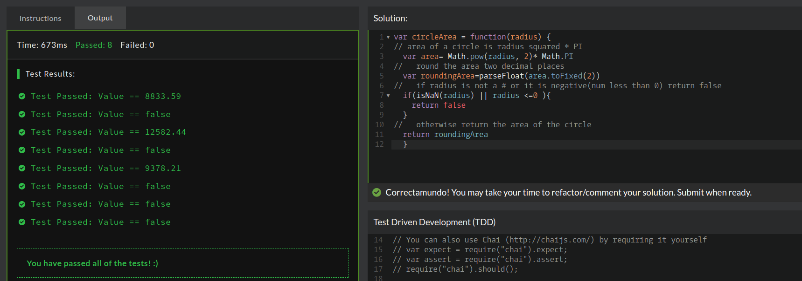

## CodeWars Challenge- 18

*Description:*
Complete the function circleArea so that it will return the area of a circle with the given radius. Round the returned number to two decimal places (except for Haskell). If the radius is not positive or not a number, return false.

*Test Cases:*

1. circleArea(-1485.86);    //returns false
2. circleArea(0);           //returns false
3. circleArea(43.2673);     //returns 5881.25
4. circleArea(68);          //returns 14526.72
5. circleArea("number");    //returns false

## Languages Used

1. JavaScript

## Takeaway:

Using the Math.pow() method kept my code cleaner when I refactored, originally I was using radius * radius.

Using the toFixed() method with an argument of two was extremely helpful for returning a rounded number that goes out two only decimal places. 
